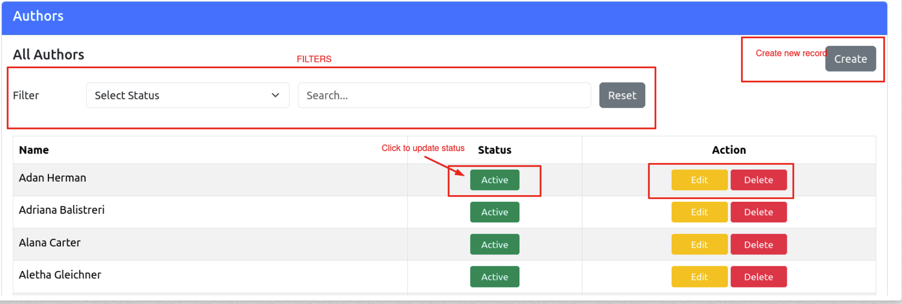
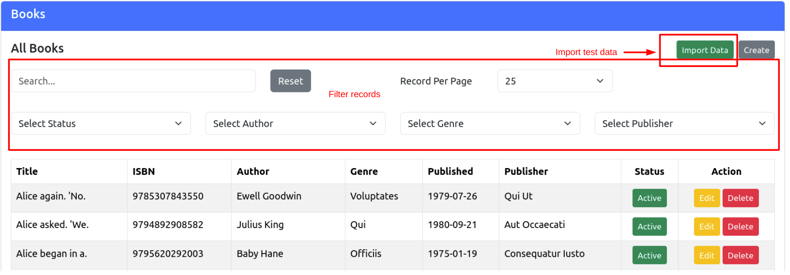

# Book Store Application

Welcome to our Book Store Application! 

This Laravel application lets you dive into the world of books. You can search and filter books according to
multiple attributes like title, author, publisher, ISBN, and genre. Ready to laugh your way through books? Let's get started!

## Installation

Follow these steps to set up the application.

1. Clone the repository to your local machine :

   ```bash
   git clone https://github.com/waseemk/Book-Store.git
   ```

2. Navigate to the project directory:

   ```bash
   cd Book-Store
   ```

3. Install composer dependencies:

   ```bash
   composer install
   ```
4. Install NPM dependencies:

   ```bash
   npm install
   ```

5. Build assets:

   ```bash
   npm run build
   ```

   ```bash
   npm run dev
   ```

6. Create a `.env` file by copying the `.env.example` file:

   ```bash
   cp .env.example .env
   ```

7. Open the `.env` file, and set your environment variables:

   - `APP_URL`: Set the URL of your application.
   - `MAIL_MAILER`: Set the mailer (e.g., `smtp`).
   - `MAIL_HOST`: Set the mail host (e.g., `smtp.mailtrap.io`).
   - `MAIL_PORT`: Set the mail port (e.g., `587`).
   - `MAIL_USERNAME`: Set your email username.
   - `MAIL_PASSWORD`: Set your email password.
   - `DB_CONNECTION`: Set your database connection name.
   - `DB_PORT`: Set the database port number.
   - `DB_DATABASE`: Set the database name.
   - `DB_USERNAME`: Set database username.
   - `DB_PASSWORD`: Set database password.

8. Generate an application key:

   ```bash
   php artisan key:generate
   ```

9. Run database migrations. It's create and modify database table and columns:

   ```bash
   php artisan migrate
   ```

10. Run database seeder. It will create test dataset:

   ```bash
   php artisan db:seed
   ```

11. Start the development server:

   ```bash
   php artisan serve
   ```

12. Access the application in your web browser at `http://localhost:8000`

## Usage

1. Login in Admin Panel Using Url http://127.0.0.1:8000/login with
   - **Username:** admin@gmail.com
   - **Password:** 123456 

2. Navigate to "Authors" Page to manage authors.
   - Create New Author by clicking 'Create' button
   - Update Status to Active/Inactive
   - Edit/Delete action
   - Search and filter Author data



3. Follow above steps for Genre and Publisher

4. Book Manager.
   - Create New book
   - Search and filter books by different attributes
   - Import test data by clicking 'Import Data' button.
   - After clicking 'Import Data' button, you need to run queue job to process the import in background.
   ```bash
   php artisan queue:work
   ```




## Dependencies

   - Laravel 10.31.0
   - Bootstrap 5.3.2
   - Vue3
   - Guzzle HTTP Client (for fetching data)

## Credits

   - This project uses data from [FakerAPI](https://fakerapi.it/api/v1/books?_quantity=100). We couldn't do it without them!

## Authors

   - * Waseem Khan (waseemkhan115@gmail.com)

## License

This project is licensed under the MIT License. See the [LICENSE](LICENSE) file for details. Enjoy !!! 